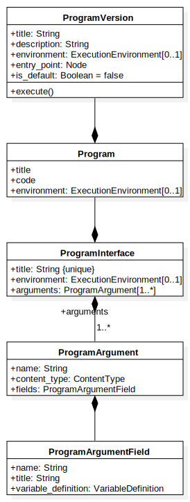

Program entities
================

.. ProgramInterface:

ProgramInterface
----------------

.. autoclass:: business_logic.models.ProgramInterface
    :members: arguments

.. ProgramArgument:

ProgramArgument
~~~~~~~~~~~~~~~~

.. autoclass:: business_logic.models.ProgramArgument

.. ProgramArgumentField:

ProgramArgumentField
~~~~~~~~~~~~~~~~~~~~

.. autoclass:: business_logic.models.ProgramArgumentField

.. Program:

Program
-------

.. autoclass:: business_logic.models.Program
    :members:

.. ProgramVersion:

ProgramVersion
--------------

.. autoclass:: business_logic.models.ProgramVersion
    :members: execute, copy

